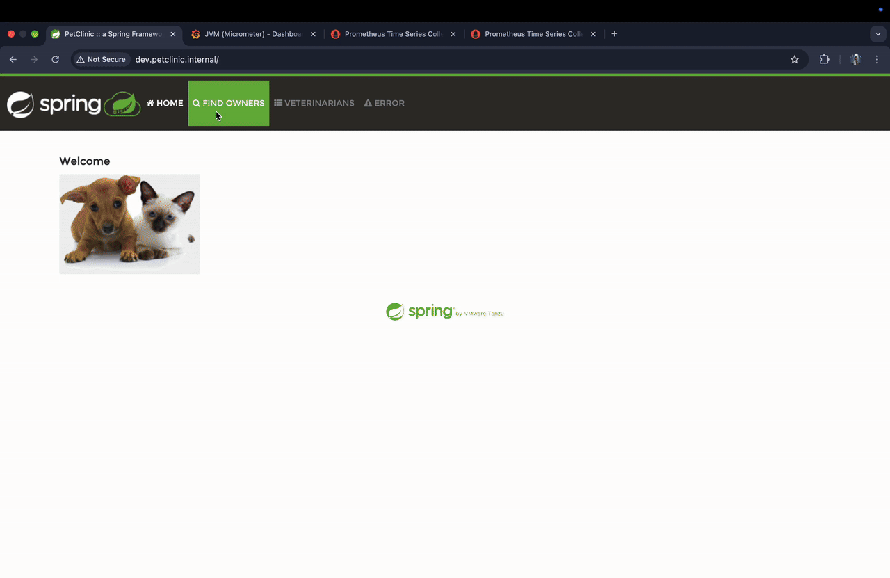
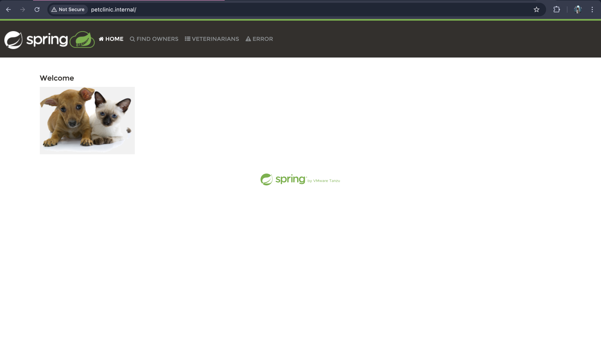
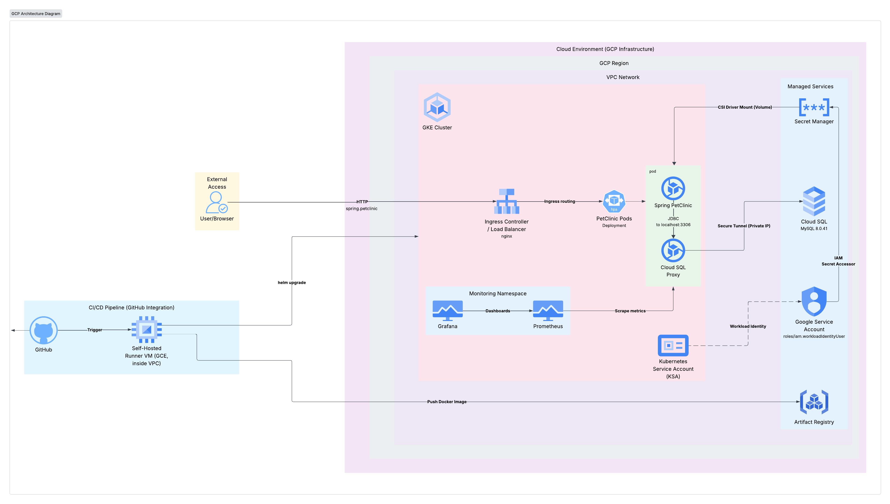
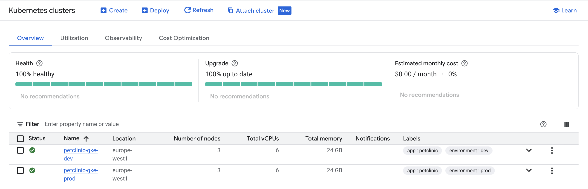
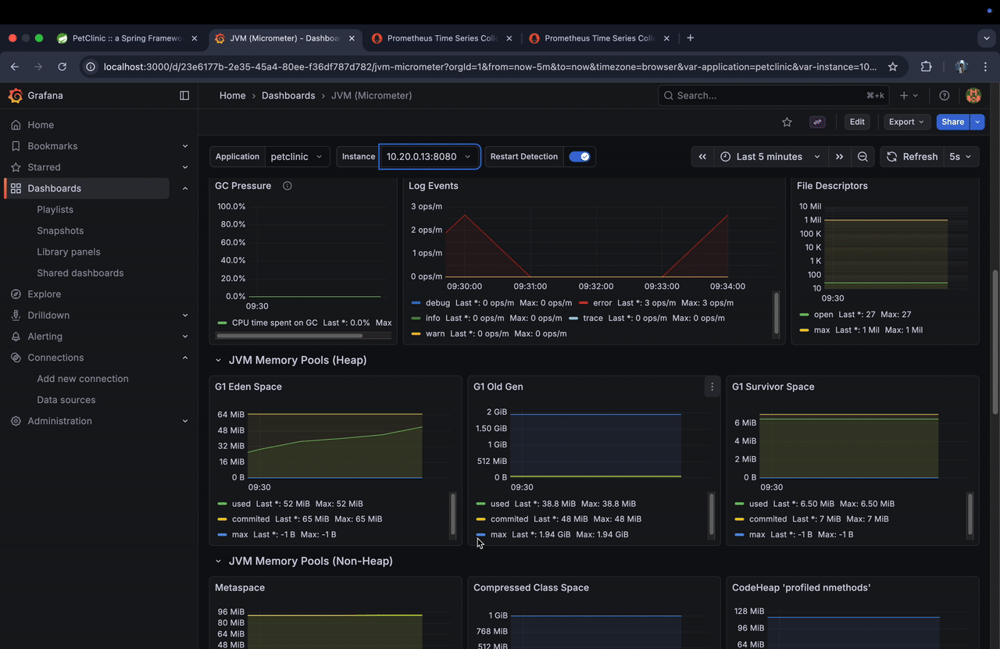

# Advanced Capstone Project: Cloud Infrastructure


This repository is a part of the DevOps Capstone Project for DevOps Internship in GridDynamics.

* This repository contains the **Infrastructure as Code (IaC)** implementation: it uses **Terraform** to provision a scalable, secure, and automated Kubernetes-based architecture on **Google Cloud Platform (GCP)**.
* The infrastructure is designed to host a Java Spring PetClinic application with high availability, automated CI/CD pipelines, and strict security practices.

Here, you can find the code for:
* Creating Self-Hosted GitHub Actions Runners (infra GCE + ARC foundation)
* Dev & Production Environment Provisioning (**one GCP project per env**)
* Custom Modules Repository
* Architecture Diagram
* Architecture Decision Records ([docs/adr](docs/adr/))

For more details, please refer to:
* [Capstone Project Description ](.github/assets/Capstone%20advanced%20k8s%20project.pdf)
* [Spring-Petclinic App Repository](https://github.com/njakov/capstone-project-app)
* [ADR 001: Runner isolation](docs/adr/001-runner-isolation.md)
* [Monitoring scrape path](docs/monitoring.md)

## Project Overview

* **Cloud Provider:** Google Cloud Platform (GCP) — **PetClinic Dev** and **PetClinic Prod** are separate projects
* **Infrastructure Tool:** Terraform (State stored in GCS with versioning; one bucket per project)
* **Orchestrator:** Google Kubernetes Engine (GKE) - Private Cluster (zonal small dev / regional HA prod)
* **Database:** Cloud SQL (MySQL) - Private IP only (`ZONAL` `db-f1-micro` in dev; `REGIONAL` `db-g1-small` in prod)
* **Secrets Management:** Google Secret Manager
* **CI/CD:** GitHub Actions — infra on GCE runners (`self-hosted,infra,{env}`); app CI on ARC (ephemeral) after cutover
* **Configuration Management:** Helm 
* **Monitoring:** Prometheus & Grafana (via Helm) 

## Project Demo
 

### Production

### Development

---

## Repository Structure

```text
├── .github/workflows/       # Infra CI (infra-pipeline.yml)
├── docs/
│   ├── adr/                 # Architecture Decision Records
│   ├── arc-cutover.md       # ARC cutover notes
│   └── monitoring.md        # Prometheus/Grafana scrape & demo path
├── environments/
│   ├── bootstrap/           # Infra VPC + runner + bootstrap-iam (chicken-egg only)
│   ├── dev/                 # Dev env: app VPC + peering + GKE/SQL/…
│   └── prod/                # Prod env (same shape; HA sizing in tfvars)
├── modules/                 # Reusable Terraform modules
│   ├── artifact-registry/   # Docker container storage
│   ├── bootstrap-iam/       # Workload SAs + project IAM + D6 grants
│   ├── cloud-sql/           # Managed MySQL database
│   ├── gke/                 # Kubernetes Cluster configuration
│   ├── identity/            # Workload Identity only (no project IAM)
│   ├── middleware/          # Helm charts (Ingress, Prometheus)
│   ├── network/             # VPC, Subnets, Firewalls, NAT
│   ├── network-peering/     # Bidirectional VPC peering (infra ↔ app)
│   ├── runner/              # Infra-only self-hosted GitHub Actions runner VM
│   └── arc/                 # ARC controller + scale set + NetworkPolicies
├── scripts/                 # Bash scripts for setup and bootstrapping
└── .tfsec/                  # Security scanner configuration
``` 

## Architecture

Bootstrap is **chicken-egg only**: infra VPC + NAT + IAP SSH + runner SA/VM + workload SAs/project IAM. The **env** apply creates the app VPC, both peering legs, then GKE/SQL/middleware. Isolation is a **project boundary** (dev ≠ prod GCP project), not IAM Conditions on `container.admin`.

See [ADR 001: Runner isolation](docs/adr/001-runner-isolation.md) for locked decisions, residuals, sizing, and trial runtime. Regenerate [`.github/assets/architecture-diagram.png`](.github/assets/architecture-diagram.png) after cutover to match this layout.

### Key Components
1.  **Network (`modules/network` + `modules/network-peering`):**
    * **Infra VPC (bootstrap):** private subnet for the GCE infra runner; IAP SSH scoped to the `infra-runner` tag.
    * **App VPC (env):** private subnet + GKE secondary ranges (pods/services). Distinct CIDRs per env/project.
    * **Peering (env):** bidirectional peering connects the infra and app VPCs. Terraform reaches the private GKE control plane through the cluster DNS endpoint over Private Google Access, not through exported custom routes (peering is not transitive; Regular-channel control planes use Private Service Connect).
    * **Cloud NAT:** private nodes/VMs egress without public IPs.
2.  **Compute (`modules/gke`, `modules/runner`, `modules/arc`):**
    * **GKE:** Private cluster with VPC-native networking on the **app** VPC. Private nodes and the private IP endpoint stay enabled; IP endpoints stay on. Helm and the Kubernetes provider use the DNS endpoint (`allow_external_traffic`) with `gke-gcloud-auth-plugin` and omit the cluster CA. Kubernetes ServiceAccount tokens and client certificates stay disabled on that name. Master authorized networks apply to the IP endpoint only (app subnet and infra runner subnet). The DNS name has no network allowlist. Second node pool `runners` is tainted (`github.runner=true:NoSchedule`) and labeled `workload=github-runner` for ARC only. Dev is **zonal**; prod is **regional** (two zones) — see ADR sizing table.
    * **Infra GitHub Runner:** GCE VM `runner-vm-infra-{env}` on the infra VPC (`e2-medium`). Register with labels `self-hosted`, `infra`, `{env}`. Day-2 path is Terraform-only (no Docker builds required on this VM).
    * **ARC:** ephemeral app runners (`petclinic-arc-{env}`) in the same GKE cluster via `modules/arc`, using `github-app-runner-sa-{env}` Workload Identity. That account has `roles/artifactregistry.writer` on `{app}-repo-{env}` and, until that binding is applied, also at project level. It has custom role `arcAppDeploy` (`container.clusters.get`, `container.clusters.getCredentials`, `container.clusters.connect`, `container.namespaces.get`). Kubernetes RBAC is a Role in `petclinic` plus get Services in `ingress-nginx`. After the env apply, remove the project-level writer from `app_runner_roles` and bootstrap-apply. Cutover steps: [docs/arc-cutover.md](docs/arc-cutover.md).
3.  **Database (`modules/cloud-sql`):**
    * Cloud SQL (MySQL 8.0) connected via Private Service Access on the **app** VPC.
    * Passwords are generated randomly and stored immediately in **Google Secret Manager**.
4.  **Security / IAM:**
    * **Workload Identity:** App pods in namespace `petclinic` use K8s SA `petclinic` mapped to `petclinic-sa-{env}`. ARC runners use a separate GCP SA. The identity module binds Workload Identity and that app-runner Kubernetes RBAC (no day-2 `google_project_iam_*`).
    * **`terraform-sa`:** conditioned `projectIamAdmin` binder for bootstrap only; **disabled** after bootstrap (`scripts/lock-terraform-sa.sh`). No project-level `serviceAccountUser`; state bucket is `storage.objectAdmin` only.
    * **`github-infra-runner-sa-{env}`:** day-2 apply identity — workload `*admin` + `networkAdmin` inside its project; **no** `projectIamAdmin` / project SA admin/user. Resource-level D6 grants from bootstrap are `infraRunnerWorkloadIdentityAdmin` on the app, app-runner, and external-secrets accounts. The condition is `hasOnly(['roles/iam.workloadIdentityUser'])`, so `setIamPolicy` may only change that role and `getIamPolicy` stays allowed. The node SA grant is `serviceAccountUser`.
    * **Secret Manager:** Centralized management for DB credentials and URLs (infra runner has `secretmanager.admin` by design).

## Architecture Diagram



## Getting Started

### Prerequisites  

1.  **GCP projects:** Dev = existing `project-62ebde90-46b7-4e70-b59` (display name **PetClinic Dev**; ID immutable). Prod = **new** project (display name **PetClinic Prod**; ID `petclinic-gke-prod`). Never reuse the dev UUID.
2.  **Google Cloud SDK:** Installed and authenticated locally (`gcloud auth login`).  
3.  **Application Default Credentials (user):** `gcloud auth application-default login` — as **your user**, without `--impersonate`. Bootstrap then forces Terraform to act as `terraform-sa` via impersonation.  
4.  **Terraform:** Installed (v1.16.0).

### Terraform authentication (two principals)

| Stage | Principal | How |
|-------|-----------|-----|
| One-time `setup_gcp.sh` / `gcloud` in scripts | Your user (Owner) | `gcloud auth login` |
| Local `bootstrap-env.sh` Terraform | `terraform-sa@PROJECT.iam.gserviceaccount.com` | User ADC + `GOOGLE_IMPERSONATE_SERVICE_ACCOUNT` (enforced by the script) and bootstrap `provider.tf` `impersonate_service_account` |
| Day-2 `infra-pipeline.yml` | `github-infra-runner-sa-{env}` on the GCE VM | Attached service account / metadata — **not** `terraform-sa`, no laptop ADC |

No SA JSON keys. CI does **not** use `terraform-sa`; that SA is for chicken-egg local bootstrap (and optional break-glass). Details: [ADR 001](docs/adr/001-runner-isolation.md).

### Destroy-old-shape warning

If live bootstrap state still owns `module.app_network` / peering, **do not** apply the slim bootstrap onto it — that deletes the app VPC under GKE. Destroy **env first**, then bootstrap, on the old shape; merge/apply the new code only on a clean project. Tear-down order is always **env → bootstrap**.

### Trial / screenshot window

* Dev may stay live up to ~1 week. Prod is a **2–3 day screenshot window** — destroy **env the same day** shots finish (regional GKE fee ticks from cluster create until delete), then destroy bootstrap. Do not leave both stacks always-on.

### Step 1: Initial GCP Setup (per project)

Run once per GCP project (pass `dev` or `prod`). Enables APIs, creates the state bucket, and configures `terraform-sa` with **conditioned** least-privilege IAM (`setup-terraform-sa.sh` is the only IAM writer).

```bash
chmod +x scripts/setup_gcp.sh
./scripts/setup_gcp.sh <ENV-NAME>
```

*   **What this does:** `create-bucket.sh` + `setup-terraform-sa.sh` (no unconditioned `projectIamAdmin`; bucket `objectAdmin` only; TokenCreator for your user on `terraform-sa`).
*   Confirm before running (workspace rule). Target project comes from `environments/bootstrap/<env>.tfvars` unless `PROJECT_ID` is set.

### Step 2: Bootstrap (infra VPC + runner + workload IAM)

Chicken-egg layer only: **infra VPC**, runner SA/VM (`e2-medium`), and `bootstrap-iam` (workload SAs + project IAM + D6). **No** app VPC. **No** peering.

```bash
chmod +x scripts/bootstrap-env.sh
./scripts/bootstrap-env.sh <ENV-NAME>
```

*   **What this does:** Verifies `terraform-sa` exists and is **enabled**, then runs Terraform **as that SA** (fails closed if disabled). Applies `environments/bootstrap/<env>.tfvars` (`infra_subnet_cidr` only for networking). Does **not** grant IAM. After a successful `terraform apply -auto-approve`, it runs `scripts/lock-terraform-sa.sh` for the same env. `set -e` skips that lock if apply fails. **A successful run means `terraform-sa` is disabled.**
*   **Output:** `runner_ssh_command` and `runner_registration_labels` (`self-hosted,infra,{env}`), then the disabled SA.
*   **Manual step:** IAP SSH to the VM, switch to user `runner`, and register the GitHub Actions runner with those labels.
*   **Break-glass** (as in `scripts/lock-terraform-sa.sh`): enable `terraform-sa`, ensure TokenCreator on your user, re-run `./scripts/bootstrap-env.sh <ENV-NAME>`, then `./scripts/lock-terraform-sa.sh <ENV-NAME>` again. A successful bootstrap already disables the SA; run the lock script on its own when the SA was re-enabled and you are not applying.

### Step 3: Environment apply (app VPC, peering, GKE, middleware, ARC)

After the infra runner is registered, apply `environments/{dev,prod}` via `infra-pipeline` (as the runner SA).

1. First apply creates the **app VPC**, both peering legs, then GKE/SQL/…. Helm talks to the control plane through the cluster DNS endpoint, not peering custom routes. With `enable_arc = true` and `arc_install_charts = false`, the runner node pool, GitHub App **Secret Manager shells**, the `arc-runners` namespace, and External Secrets are created.
2. Populate secret versions (App ID, installation ID, private key PEM), then wait until `kubectl get externalsecret arc-github-app -n arc-runners` is Ready. External Secrets writes Kubernetes secret `arc-github-app`. Terraform must not own that secret — see [docs/arc-cutover.md](docs/arc-cutover.md). Database secrets are unchanged; the app still reads those through its own Workload Identity binding.
3. Set `arc_install_charts = true` and apply again to install the controller, scale set, and NetworkPolicies.
4. Confirm `petclinic-arc-{env}` appears under GitHub → Settings → Actions → Runners.

First **prod** env apply budgets **45–90 minutes**.

### Step 4: GitHub Environment protection

`project_id` and `region` live only in `environments/{dev,prod}/terraform.tfvars` (and the matching bootstrap tfvars). CI does not set `TF_VAR_project_id` or `TF_VAR_region`.

**Fail closed before `terraform init`:** validate, plan, apply, and destroy share a checkout-time guard. The job fails when `environments/${env}/terraform.tfvars` is missing or `project_id` cannot be parsed. The state bucket is `terraform-state-bucket-${project_id}` from that file. The guard does not read `vars.GCP_PROJECT_ID`, `vars.GCP_REGION`, or `vars.TF_STATE_BUCKET`.

**Delete leftover GitHub variables** at repository scope and on the `dev` and `prod` Environments. Those names are not the source of truth. Remove the repository copies once any Environment copies exist, then remove the Environment copies too:

* `GCP_PROJECT_ID`
* `GCP_REGION`
* `TF_STATE_BUCKET`

```bash
# Repository scope (already removed if `gh variable list` does not show them):
gh variable delete GCP_PROJECT_ID
gh variable delete GCP_REGION
gh variable delete TF_STATE_BUCKET

# Environment scope:
for env in dev prod; do
  gh variable delete GCP_PROJECT_ID --env "$env"
  gh variable delete GCP_REGION --env "$env"
  gh variable delete TF_STATE_BUCKET --env "$env"
done
```

Keep the GitHub Environments named `dev` and `prod`. `infra-pipeline.yml` still sets `environment:` on validate, plan, apply, and destroy so deployment protection applies.

**Prod required reviewers (operator step):** required reviewers cannot be set from `infra-pipeline.yml`. After the `prod` Environment exists, add them under Settings → Environments → `prod` → Deployment protection rules. Validate, plan, apply, and destroy all set `environment: prod`, so those reviewers gate every prod plan and destroy, not only apply.

Keep authenticators as secrets (e.g. `TF_VAR_grafana_admin_password` when set). App-repo Environment vars for deploy workflows are a **separate PR** in `capstone-project-app`.

### Negative IAM tests (teaching demo)

After setup + bootstrap (with `terraform-sa` still enabled for tests 1–2):

```bash
./scripts/negative-iam-tests.sh <ENV-NAME>
```

Expect `PERMISSION_DENIED` for: (1) terraform-sa binding `roles/owner`, (2) terraform-sa creating GKE/SQL, (3) runner `setIamPolicy` on terraform-sa, (4) runner minting keys on the workload service accounts, including `external-secrets-{env}`. Confirm before running (live `gcloud` calls).

### Local `terraform validate`

```bash
# Bootstrap
(cd environments/bootstrap && terraform init -backend=false && terraform validate)

# Dev / prod (placeholder project_id in prod tfvars is OK for validate)
(cd environments/dev && terraform init -backend=false && terraform validate)
(cd environments/prod && terraform init -backend=false && terraform validate)
```

CI also greps day-2 paths so they never reintroduce project IAM resources.

### Retarget GCP project

When switching to a different GCP project:

1. Edit committed tfvars `project_id` (and `region`, if it changes) in `environments/bootstrap/{dev,prod}.tfvars` and `environments/{dev,prod}/terraform.tfvars`. Placeholder shapes live in the matching `*.tfvars.example` files. CI derives the state bucket as `terraform-state-bucket-${project_id}`.
2. Run setup/bootstrap with `PROJECT_ID` unset so scripts read tfvars, or `export PROJECT_ID=...` to override. A successful `bootstrap-env.sh` disables `terraform-sa`.
3. Apply the env stack (`infra-pipeline`), then deploy the app from the app repo.

Operator convenience outputs after env apply: `app_sa_email`, `cloud_sql_connection_name` (CI uses deterministic names; outputs are for docs / local Helm).

CI/CD Pipelines
------------------

Infra apply runs only through **`infra-pipeline.yml`** on runners labeled `self-hosted` + `infra` + `{env}`.

### Main Infrastructure Pipeline (`infra-pipeline.yml`)

*   **Trigger:** Pushes to `main` (plans **dev**), or manual `workflow_dispatch` for `dev` / `prod` with `plan` / `apply` / `destroy`.
*   **Protection:** Production deploys a commit that is contained in `main`. Setup resolves the ref once to a commit SHA, and validate, plan, apply, and destroy all check out that same SHA. The setup job accepts only `dev` or `prod`, rejects a ref that contains a newline, and writes job outputs with a delimiter. Those jobs use the GitHub Environment for deployment protection. `project_id` and `region` come from `environments/${env}/terraform.tfvars`. Apply and destroy download `gs://terraform-state-bucket-${project_id}/plans/${env}/${run_id}.tfplan` from the state bucket and delete that object only after a successful apply. A failed apply leaves the object in place. Plan-only runs delete the object immediately. A one-day lifecycle rule on `plans/` is the backstop. Required reviewers on prod are an operator setting (Step 4); this workflow cannot configure them. Restrict the `prod` Environment deployment branches to `main`, and require reviewers on plan and destroy as well as apply.
*   **Runner:** `[self-hosted, infra, dev|prod]` — must match the GCE infra runner registration labels.
*   **Guards:** Before `terraform init`, validate, plan, apply, and destroy fail closed unless `environments/${env}/terraform.tfvars` exists and `project_id` parses. They init `terraform-state-bucket-${project_id}` from that value. CI also fails if `google_project_iam_` appears under `environments/{dev,prod}` or `modules/{gke,identity,cloud-sql}`.

Application build/release/deploy workflows live in the **[capstone-project-app](https://github.com/njakov/capstone-project-app)** repository (not this repo). After ARC cutover they target scale set names such as `petclinic-arc-dev` / `petclinic-arc-prod`.

### Google Cloud Platform 


### Application Deployment Pipelines (app repo)

| Workflow | Trigger | Description |
| :--- | :--- | :--- |
| **PR Release** (`pr-release.yml`) | Pull Request | Unit tests, static analysis, Trivy; builds to the **dev** registry. |
| **Main Release** (`main-release.yml`) | Push to `main` | SemVer tag after tests/scan, image push to the **prod** registry. |
| **Manual Deploy** (`manual-deploy.yml`) | Manual Dispatch | Helm deploy of a chosen version to the target environment. |

## Tools & Technologies Used

| Category | Tool | Description |
| :--- | :--- | :--- |
| **IaC** | Terraform | Infrastructure provisioning (v1.16.0). |
| **State** | GCS | Remote backend with versioning enabled. |
| **Container** | Docker / Kaniko | Packaging; ARC builds prefer Kaniko (non-privileged). |
| **Orchestration** | Kubernetes (GKE) | Container management with VPC-native networking. |
| **Charts** | Helm | Deploying Nginx Ingress and Prometheus stack. |
| **Security** | TFSec / TFLint | Static analysis for Terraform code. |
| **Secrets** | Secret Manager | Secure storage for Database credentials and URLs. |
| **CI/CD** | GitHub Actions | Infra on GCE; app on ARC ephemeral runners (after cutover). |

Monitoring & Middleware
--------------------------

The modules/middleware module installs essential shared services into the cluster via Helm:

1.  **Nginx Ingress Controller:** Managed via Helm as a `LoadBalancer` Service. Access is **source-restricted** via `allowed_source_ranges` in each environment's `terraform.tfvars` (operator IP or VPN CIDR) — not public-by-default (`0.0.0.0/0` is rejected). TLS / cert-manager is out of MVP scope; HTTP only is an accepted demo limit.

2.  **Kube Prometheus Stack:** Deploys Prometheus, Grafana, and Alertmanager into the `monitoring` namespace with demo-sized retention (`7d`) and a `10Gi` PVC. Prometheus discovers app `ServiceMonitor` / `PrometheusRule` CRs labeled `release: prometheus-community` in **all** namespaces (including `petclinic`). Grafana’s dashboard sidecar uses `searchNamespace: ALL` so the app chart’s Micrometer dashboard ConfigMap loads from the `petclinic` namespace.

**App scrape path (primary):** Prometheus scrapes Spring Actuator `/actuator/prometheus` on the PetClinic Service port `http-web` (→ container `8080`). The JMX agent on container `:9093` is optional/local only and is **not** a cluster scrape target. Full walkthrough, Grafana password notes, and Gate H demo steps: [docs/monitoring.md](docs/monitoring.md).

**Grafana admin:** if `grafana_admin_password` is unset, the chart default is `admin` / `prom-operator`. Prefer a one-time secret via `TF_VAR_grafana_admin_password` (do not commit).

 

Important Notes
------------------

*   **State Management:** The Terraform state is stored remotely in a GCS bucket (`terraform-state-bucket-${project_id}` — one per project).
    
*   **Tear down:** Destroy **env first**, then bootstrap. Destroy GKE the same day prod screenshots finish.
    
*   **Ingress access:** `allowed_source_ranges` in each environment's `terraform.tfvars` limits who can reach the Ingress LoadBalancer. Update it if your public IP changes.
    
*   **Security:** Public access to the database is disabled. The Cloud SQL instance only allows connections via Private Service Access (VPC Peering).
    
*   **SSH Access:** SSH to the infra runner is IAP-only, scoped to the `infra-runner` network tag.
    
*   **Runner labels:** Register infra runners as `self-hosted,infra,{env}` or the infra pipeline will not pick them up.

*   **Terraform identity:** Local bootstrap impersonates `terraform-sa` then **locks/disables** it; `infra-pipeline` applies as `github-infra-runner-sa-{env}` on the VM. Do not bake `--impersonate` into ADC — use plain `gcloud auth application-default login`.
    
*   **Cost:** Real resources (GKE, LBs, Cloud SQL). Prefer short-lived prod; run the **Destroy** workflow for env, then destroy bootstrap.
